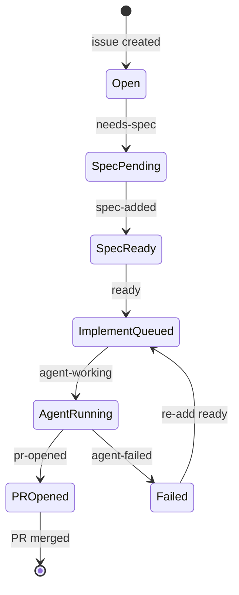

# GitHub labels

issue-bench uses labels as a visible state machine on each issue.

## Label reference

| Label | Applied by | Meaning |
|-------|------------|---------|
| `needs-spec` | Human | Request AI acceptance criteria (Stage 1) |
| `spec-added` | Stage 1 (automatic) | Spec comment posted on the issue |
| `ready` | Human | Approve spec; trigger implementation (Stage 2) |
| `agent-working` | Stage 2 (automatic) | Cursor cloud agent is running |
| `pr-opened` | Agent (or manual fallback) | Implementation PR is open |
| `agent-failed` | Stage 2 on failure | Dispatch or implementation failed; safe to retry |

## State machine

```text
Open → needs-spec → spec-added → ready → agent-working → pr-opened → (merged)
                              ↑                              ↓
                              └──────── agent-failed ────────┘
```



## Creating labels

Labels are created automatically on first workflow run. To create them upfront:

```bash
npx issue-bench init --create-labels --repo owner/repo --yes
```

Or manually under **Issues → Labels** using the colors in the table above.
